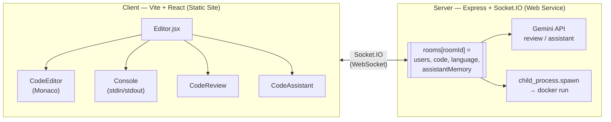

# CodeTogether

A real-time collaborative code editor. Multiple users join a room, edit the
same Monaco buffer over a raw Socket.IO connection, and can pull an AI code
review or ask a room-aware coding assistant — all without a database, since
room state only needs to live as long as the room does.

**Live:**
[Client](https://codetogether-client.onrender.com) ·
[Server](https://codetogether-rqqk.onrender.com)

> Free-tier hosting — the server spins down after ~15 minutes idle and takes
> 30-50s to wake on the first request. The **Run** button (Java/Python/C++
> execution) works locally but not on the hosted demo — see
> [Code execution](#code-execution) below for why.

## Architecture



There's no database. `rooms` is an in-memory object on the server, keyed by
room ID; it's created on the first `join-room` and deleted when the last
user disconnects. The one thing that *is* persisted to disk is AI assistant
memory per room (`Server/uploads/assistant-memory/<roomId>.json`), so a
reload mid-conversation doesn't lose context — but it's deleted the moment
the room empties out, same lifecycle as everything else.

## Features

- **Real-time sync** — `code-change` events are broadcast to everyone else
  in the room; there's no operational-transform or CRDT layer, so this is
  last-write-wins, not conflict-free merging.
- **Room-scoped usernames** — join is rejected server-side if the username
  is already taken in that room, checked atomically against the room's user
  list rather than trusting the client.
- **AI code review** — sends the current buffer to Gemini
  (`gemini-2.5-flash-lite`, with `gemini-3.1-flash-lite` as an automatic
  fallback on quota/rate-limit errors) and broadcasts the markdown review to
  the whole room.
- **AI coding assistant with memory** — each room keeps a running summary +
  recent-turns window. When the recent turns cross a size threshold, older
  ones get compressed into the summary via a second Gemini call, so long
  sessions don't blow up the prompt.
- **Sandboxed code execution** (local only) — `run-code` writes the
  submitted source to a per-job temp directory and runs it inside a locked-down
  container: `--network none`, `--memory=256m`, `--cpus=1`,
  `--pids-limit=64`, 5-second timeout, directory cleaned up after. See
  [`Server/dockerCommand.js`](Server/dockerCommand.js).

## Code execution

`run-code` shells out to `docker run` directly — it needs a real Docker
daemon on the box the server is running on. Render's free web services (and
most PaaS free tiers) don't grant containers access to run nested Docker, so
on the hosted demo this fails closed: the console shows `docker: not found`
instead of executing anything. Everything else — sync, rooms, AI review, AI
assistant — runs fine there, since none of that touches Docker.

To get code execution working, run the server locally with Docker Desktop
installed (see below), or deploy the server to a host with a real Docker
daemon (a VPS with Docker installed, not a PaaS free tier).

## Getting started

**Prerequisites:** Node.js 18+, and Docker (only if you want the Run button
to work).

```bash
git clone https://github.com/ankitsingathia/codetogether.git
cd codetogether
```

**Server**

```bash
cd Server
npm install
```

Create `Server/.env`:

```env
PORT=3001
BACKEND_URL=http://localhost
FRONTEND_ORIGIN=http://localhost:5173
GEMINI_API_KEY=your_gemini_api_key
```

Get a key at [aistudio.google.com/apikey](https://aistudio.google.com/apikey)
— required for AI review/assistant, not for editing or sync.

```bash
npm run dev
```

**Client**

```bash
cd Client
npm install
```

Create `Client/.env`:

```env
VITE_SOCKET_URL=http://localhost:3001
```

```bash
npm run dev
```

Open two browser windows at `http://localhost:5173`, join the same room from
both, and edit — changes should sync instantly between them.

## Deploying your own instance

Both services deploy free on Render:

| Service | Type | Root | Build | Start |
|---|---|---|---|---|
| Server | Web Service | `Server` | `npm install` | `npm start` |
| Client | Static Site | `Client` | `npm install && npm run build` | publish `dist` |

Env vars: `GEMINI_API_KEY` on the server; `VITE_SOCKET_URL` on the client set
to the server's URL; then `FRONTEND_ORIGIN` on the server set to the
client's URL once you have it (the server rejects any Socket.IO origin not
in this list — see `isAllowedOrigin` in
[`Server/index.js`](Server/index.js)).

## Tech stack

**Client** — React 18, Vite, Socket.IO client, Monaco Editor, Tailwind CSS,
react-markdown + remark-gfm for rendering review output, react-router-dom.

**Server** — Node.js, Express, Socket.IO, `@google/genai` (Gemini), UUID for
job/room IDs, dotenv.

## Project structure

```
Server/
├── index.js            Socket.IO event handlers, room state, Gemini calls
├── dockerCommand.js     Per-language `docker run` command builder
└── uploads/
    └── assistant-memory/  Per-room AI conversation memory (JSON)

Client/
└── src/
    ├── pages/           Home, CreateRoom, Editor
    ├── components/       CodeEditor, Console, CodeReview, CodeAssistant
    ├── layouts/          AppLayout, EditorLayout
    ├── lib/RoomSocket.js  Thin wrapper over the socket.io-client instance
    └── contexts/ThemeContext.jsx
```

## Known limitations

- **Last-write-wins sync, not CRDT.** Two people typing in the exact same
  spot at the exact same moment can produce a jumbled result. Fine for a
  pair coding on a call; wouldn't hold up at Google-Docs-style concurrent
  editing scale.
- **Room state is in-memory.** A server restart drops every active room.
  There's no reconnect-and-resume across a redeploy.
- **No auth.** Anyone with the room link and a free username can join.
  Rooms are unlisted, not private.

## Contact

Ankit Singathia — [github.com/ankitsingathia](https://github.com/ankitsingathia)
