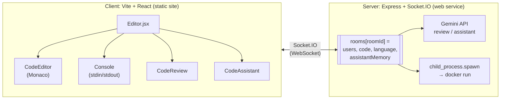

# CodeTogether

A real-time collaborative code editor. People join a room and edit the same
Monaco editor over Socket.IO. From the same room they can ask Gemini for a
code review or ask a coding assistant that remembers the conversation. There
is no database: a room only exists while someone is in it.

**Live:**
[Client](https://codetogether-client.onrender.com) ·
[Server](https://codetogether-rqqk.onrender.com)

> Both run on Render's free tier. The server sleeps after about 15 minutes
> idle and takes 30-50 seconds to wake up. The **Run** button (Java, Python,
> C++) only works locally, not on the hosted demo. [Code execution](#code-execution)
> explains why.

## Architecture


```mermaid
flowchart LR
    subgraph Client["Client: Vite + React (static site)"]
        Editor["Editor.jsx"]
        CodeEditor["CodeEditor\n(Monaco)"]
        Console["Console\n(stdin/stdout)"]
        CodeReview["CodeReview"]
        CodeAssistant["CodeAssistant"]
        Editor --> CodeEditor & Console & CodeReview & CodeAssistant
    end

    subgraph Server["Server: Express + Socket.IO (web service)"]
        Rooms[["rooms[roomId] =\nusers, code, language,\nassistantMemory"]]
        Gemini["Gemini API\nreview / assistant"]
        Docker["child_process.spawn\n→ docker run"]
        Rooms --> Gemini
        Rooms --> Docker
    end

    Client <-->|"Socket.IO\n(WebSocket)"| Rooms
```

`rooms` is a plain in-memory object on the server, keyed by room ID. It is
created on the first `join-room` and deleted when the last user disconnects.

The only thing written to disk is the assistant's memory for each room
(`Server/uploads/assistant-memory/<roomId>.json`), so reloading the page in the
middle of a conversation keeps the context. That file is deleted when the room
empties, like everything else.

## Features

- **Real-time sync.** Each `code-change` event is sent to everyone else in the
  room. There is no operational transform or CRDT, so the last write wins.
- **Unique usernames per room.** The server rejects a join if the name is
  already taken in that room, ignoring case. The check happens on the server,
  not in the client.
- **AI code review.** Sends the current code to Gemini (`gemini-2.5-flash-lite`,
  falling back to `gemini-3.1-flash-lite` on quota or rate-limit errors) and
  shows the review to the whole room.
- **Coding assistant with memory.** Each room keeps a short summary plus the
  last few turns. Once there are more than 8 turns or 1,200 characters, a
  second Gemini call folds the older turns into the summary, so long sessions
  don't grow the prompt without limit.
- **Sandboxed code execution** (local only). `run-code` writes the code to a
  temp folder for that job and runs it in a Docker container with
  `--network none`, `--memory=256m`, `--cpus=1`, `--pids-limit=64` and a
  5-second timeout, then deletes the folder. See
  [`Server/dockerCommand.js`](Server/dockerCommand.js).
- **Runs without a Gemini key.** Editing, rooms and sync work without one. Review
  and assistant requests then get a "key missing" error instead of an answer.

## Code execution

`run-code` calls `docker run` directly, so it needs a Docker daemon on the
machine running the server. Render's free web services, like most free PaaS
tiers, can't run Docker inside the container. On the hosted demo the console
shows `docker: not found` and nothing is executed. Sync, rooms, review and the
assistant don't touch Docker, so they work there.

To use the Run button, run the server locally with Docker Desktop installed, or
deploy it to a VPS that has Docker.

## Getting started

**Prerequisites:** Node.js 18+, and Docker if you want the Run button.

```bash
git clone https://github.com/ankitsingathia/codetogether.git
cd codetogether
```

**Server**

```bash
cd Server
npm install
```

Create `Server/.env`:

```env
PORT=3001
BACKEND_URL=http://localhost
FRONTEND_ORIGIN=http://localhost:5173
GEMINI_API_KEY=your_gemini_api_key
```

You can get a key at [aistudio.google.com/apikey](https://aistudio.google.com/apikey).
It is only needed for review and the assistant.

```bash
npm run dev
```

**Client**

```bash
cd Client
npm install
```

Create `Client/.env`:

```env
VITE_SOCKET_URL=http://localhost:3001
```

```bash
npm run dev
```

Open `http://localhost:5173` in two browser windows, join the same room in
both, and type in one. The other should update straight away.

## Tests and CI

```bash
cd Server
npm test
```

[`Server/test/server.test.js`](Server/test/server.test.js) starts the real
server with no Gemini key and connects to it with Socket.IO clients, the way two
browser tabs would. It checks that:

- the server starts without a key
- a new room starts with the Java template
- usernames are unique within a room, ignoring case
- an edit reaches the other members and isn't sent back to the sender
- a room resets once everyone has left
- review and assistant requests without a key return an error and the server
  stays up

The first run of these tests found a real bug: the Gemini SDK throws when it is
created without a key, so the server crashed on startup even though the review
and assistant handlers were written to handle a missing key. It now creates the
client only when a key is set.

[CI](.github/workflows/ci.yml) runs the server tests, and the client's lint and
production build, on every push and pull request.

## Deploying your own instance

Both services deploy free on Render:

| Service | Type | Root | Build | Start |
|---|---|---|---|---|
| Server | Web Service | `Server` | `npm install` | `npm start` |
| Client | Static Site | `Client` | `npm install && npm run build` | publish `dist` |

Set `GEMINI_API_KEY` on the server and `VITE_SOCKET_URL` on the client (the
server's URL). Once the client has a URL, set `FRONTEND_ORIGIN` on the server to
it. The server rejects Socket.IO connections from any other origin (see
`isAllowedOrigin` in [`Server/index.js`](Server/index.js)).

## Tech stack

**Client:** React 19, Vite, Socket.IO client, Monaco Editor, Tailwind CSS,
react-markdown with remark-gfm for the review output, react-router-dom.

**Server:** Node.js, Express 5, Socket.IO, `@google/genai` (Gemini), uuid for
job and room IDs, dotenv. Tests use Node's built-in test runner.

## Project structure

```
Server/
├── index.js             Socket.IO event handlers, room state, Gemini calls
├── dockerCommand.js     Builds the `docker run` command for each language
├── test/                Socket-level tests against the running server
└── uploads/             Assistant memory per room, created at runtime (not in git)

Client/
└── src/
    ├── pages/            Home, CreateRoom, Editor
    ├── components/       CodeEditor, Console, CodeReview, CodeAssistant
    ├── layouts/          AppLayout, EditorLayout
    ├── lib/RoomSocket.js  Thin wrapper around the socket.io-client instance
    └── contexts/ThemeContext.jsx
```

## Known limitations

- **Last write wins, not a CRDT.** If two people type in the same spot at the
  same moment, the text can come out jumbled. That's fine for two people pair
  programming on a call, not for Google Docs-style editing by many people at
  once.
- **Room state is in memory.** Restarting the server drops every active room,
  and there's no way to reconnect and resume after a redeploy.
- **No auth.** Anyone with the room link and an unused username can join.
  Rooms are unlisted, not private.

## Contact

Ankit Singathia, [github.com/ankitsingathia](https://github.com/ankitsingathia)
